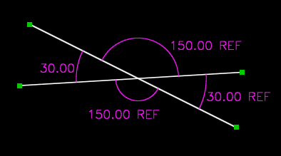

Angle
######

This constraint sets the angle between two vectors.  A vector is
anything with a direction; in SolveSpace, line segments and normals are
both vectors.  (So the constraint could apply to two line segments, or
to a line segment and a normal, or to two normals.) The angle
constraint is available in both projected and 3D versions.

The angle must always lie between 0 and 180 degrees.  Larger or smaller
angles may be entered, but they will be taken modulo 180 degrees.  The
sign of the angle is ignored.

When two lines intersect, four angles are formed.  These angles form
two equal pairs.  For example, the pictured lines interesect at 30
degrees and 150 degrees.  These two angles (30 and 150) are known as
supplementary angles, and they always sum to 180 degrees.

(Notice that in the sketch, three of the angle constraints are
reference dimensions.  Given any one of the angles, we could calculate
the other three; so a sketch that specified more than one of those
angles would be overconstrained, and fail to solve.)

When a new angle constraint is created, SolveSpace chooses arbitrarily
which supplementary angle to constrain.  An arc is drawn on the sketch,
to indicate which angle was chosen.  As the constraint label is
dragged, the arc will follow.

If the wrong supplementary angle is constrained, then select the
constraint and choose :menuselection:`Constrain --> Other Supplementary
Angle`.  A constraint of 30 degrees on one supplementary angle is
exactly equivalent to a constraint of 150 degrees on the other.
