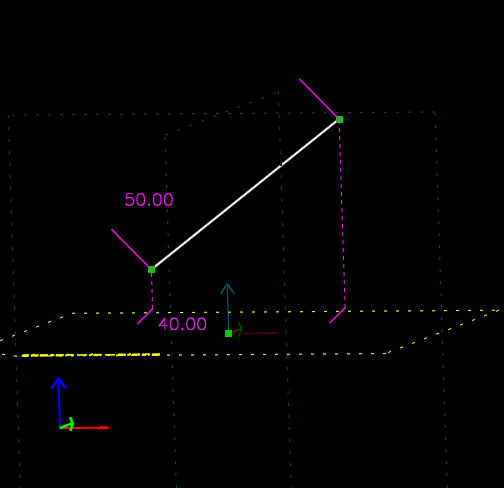
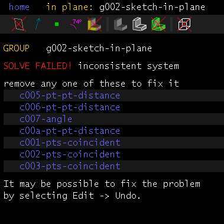

:tocdepth: 4

Constraints
###########

General
=======

To create a constraint, first select the geometry to be constrained.
For example, when constraining the distance between two points, first
select those two points.  Then choose the appropriate constraint from
the :menuselection:`Constrain` menu.

Depending on what is selected, the same menu item may generate
different constraints.  For example, the
:menuselection:`Distance/Diameter` menu item will generate a diameter
constraint if a circle is selected, but a length constraint if a line
segment is selected.  If the selected items do not correspond to an
available constraint, then SolveSpace will display an error message,
and a list of available constraints.

Most constraints are available in both 3d and projected versions.  If a
workplane is active, then the constraint applies on the projection of
the geometry into that workplane.  If no workplane is active, then the
constraint applies to the actually geometry in free space.

For example, consider the line shown below:

The line's length is constrained in two different ways.  The upper
constraint, for 50 mm, applies to its actual length.  The lower
constraint, for 40 mm, applies to the length of its projection into the
XY plane.  (The XY plane is highlighted in yellow.) The dotted purple
lines are drawn to indicate the locations of the line segment's
projected endpoints.

In normal operation, the user activates a workplane (or a workplane is
activated automatically, for example by creating a
:menuselection:`Sketch in New Workplane` group).  The user then draws
an entity, for example a line.  Since a workplane is active, the line
is created in that workplane.  The user then constrains that line, for
example by specifying its length.  Since the workplane is still active,
the constraint actually applies to the projection of the line segment
into the workplane.

In this case, the projected distance is equivalent to the 3d distance.
If the line segment lies in the workplane, then the projection of that
line segment into the workplane is just that line segment.  This means
that when drawing in a workplane, most of this can be ignored.

It's possible to use projected constraints in more complex ways,
though.  For example, the user might create a line segment in workplane
A, and constrain its projection into workplane B.

Constraints are drawn in purple on the sketch.  If a constraint has a
label associated with it (e.g.  a distance or an angle), then that
label may be repositioned by dragging it with the mouse.  To modify the
dimension, double-click the label; a text box will appear on the
screen, where the new value can be entered.  Press :kbd:`Enter` to
commit the change, or :kbd:`Esc` to cancel.

Failure to Solve
================

In some cases, the solver will fail.  This is usually because the
specified constraints are inconsistent or redundant.  For example, a
triangle with internal angles of 30, 50, and 90 degrees is inconsistent
-- the angles don't sum to 180, so the triangle could never be
assembled.  This is an error.

A triangle with internal angles constrained to 30, 50, and 100 degrees
is also an error.  This is not inconsistent, because the angles do sum
to 180 degrees; but it's redundant, because only two of those angles
need to be specified.

If the sketch is inconsistent or redundant, then the background of the
graphics window is drawn in red (instead of the usual black), and an
error is displayed in the text window:

As a convenience, SolveSpace calculates a list of constraints that
could be removed to make the sketch consistent again.  To see which
constraints those are, hover the mouse over the links in the text
window; the constraint will appear highlighted in the graphics window.
By deleting one or more of the constraints in that list, the user can
make the sketch consistent again.

A different type of error occurs when the solver fails to converge.
This may be a defect in the solver, or it may occur because impossible
geometry was specified (for example, a triangle with side lengths 3, 4,
and 10; 3 + 4 = 7 < 10).  In that case, a similar error message is
displayed, but without a list of constraints to remove to fix things.
The problem can be resolved by removing or editing the constraints, or
by choosing :menuselection:`Edit --> Undo`.

Specific Constraints
====================

To get help on a specific constraint, choose its menu item without
first selecting any entities.  An error message will be displayed,
listing all of the possibilities.

In general, the order in which the entities are selected doesn't
matter.  For example, if the user is constraining point-line distance,
then they might select the point and then the line, or the line and
then the point, and the result would be identical.  Some exceptions
exist, and are noted for each resp. type of constraint.

.. toctree::
   :maxdepth: 3

   distance_diameter
   reference_dimensions
   angle
   horizontal_vertical
   point_curve_plane
   equal_length_radius_angle
   length_ratio
   midpoint
   symmetric
   parallel_tangent
   perpendicular
   orientation
   comment

.. length_difference

