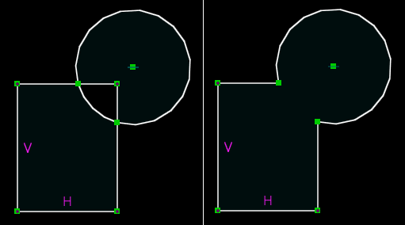

Splitting and Trimming
#######################

In some cases, it is desirable to draw by creating overlapping figures,
and then removing the extra lines.  For example, in this case, a circle
and a rectangle are drawn; the two short lines and the short arc are
then deleted, to form a single closed shape.

In order to trim the extra lines, it is necessary to split the entities
where they intersect.  SolveSpace can split lines, circles, arcs, and
Bezier curves against each other.  To do so, select the two entities to
be split, and then choose :menuselection:`Sketch --> Split Curves at
Intersection`.  This deletes each original entity, and replaces it with
two new entities that share an endpoint at the intersection.  The
excess lines may then be deleted as usual.

..  warning::
    Because the original entities are deleted, any constraints on the
    original entities are deleted as well.  This means that the sketch
    may no longer be constrained as desired after splitting.  If an
    entity is marked as construction (via :menuselection:`Sketch -->
    Toggle Construction`) before splitting, then it will not be deleted
    and the constraints will persist.
